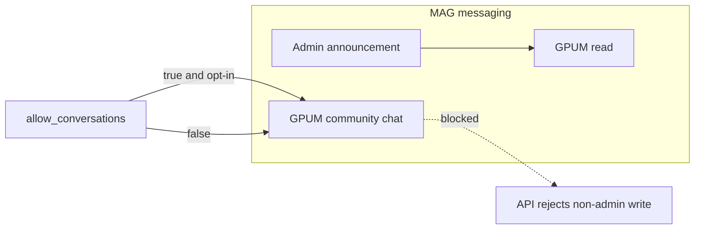

# Message Center roadmap

**Reference copy:** This file is the Message Center plan from Cursor Plan mode, kept in-repo at `docs/reference/plan-message-center-roadmap.md` (naming: `plan-<kebab-slug>.md` per `.cursor/rules/plans-reference.mdc`).

**Implementation status:** [planlog.md](../planlog.md) Phase **18C**, [changelog.md](../changelog.md) (e.g. 2026-03-26 Message Center entry), and the wiring checklist [messages-and-notifications-wiring.md](./messages-and-notifications-wiring.md). Code map: [mvt.md](../mvt.md) (Admin Message Center section).

---

## Product naming and UX

- Surface label: **Message Center** everywhere (replaces mixed “Messages and Notifications” in admin/GPUM).
- **Hybrid default:** one chronological stream + toggles **Conversations only** / **Notifications only**.
- Admin dashboard list: **thread heads** (one row per `conversation_threads` + last message preview), not every `thread_messages` row.

## Data model and Customizer

- **Three Customizer scopes** (seed via migration + code fallback): `message_center_category`, `message_center_timeline_kind`, `message_center_thread_type`.
- **Canonical timeline kind** for forms: `form_submitted` (treat `form_submission` as read-side alias until backfilled).
- **Icons/importance:** map via Customizer / metadata; see [messages-and-notifications-wiring.md](./messages-and-notifications-wiring.md).

## MAG: member chat vs admin announcements

**Intent:** A MAG can behave like a **mailing list for admins**: top-level tenant admins post **announcements** about the MAG and its related product; GPUM members are **recipients** / readers. That must work **even when** member-to-member or GPUM community chat in that MAG is turned off.

| Control | Who | Effect |
| --- | --- | --- |
| **MAG `allow_conversations` (or equivalent)** | Tenant admin | When **off**: GPUM (and possibly other non-admins) **cannot start or participate in peer/community threads** for that MAG’s “social” channel. Support/admin-directed threads stay outside this gate. |
| **Admin MAG announcements** | Top-level admins (e.g. superadmin + tenant admin) | **Always allowed** for MAGs they manage: **create posts** visible to MAG members (signed-in GPUM with membership). Behaves like **broadcast**: members **read** announcements; **no member reply** when conversations are disabled (v1 default: read-only for members on announcement stream). |

**Implementation sketch (choose one in build; recommend A for fewer moving parts):**

- **A — Same `mag_group` thread, role-gated writes:** One canonical thread per MAG (`thread_type = mag_group`, `mag_id`). `allow_conversations = false` ⇒ server rejects **non-admin** `thread_messages` inserts; **admins** may still insert. Members remain **participants** for visibility/unread (or infer visibility from `crm_contact_mags`). UI: GPUM sees **announcements feed** (no composer); admin UI shows **composer** for that MAG.
- **B — Split types:** e.g. `mag_announcement` (broadcast, admin-only write) vs `mag_community` (optional, gated by `allow_conversations`). More explicit but more threads to join in the merged stream.

**Cross-link:** [messages-and-notifications-wiring.md](./messages-and-notifications-wiring.md) — MAG group room row (admin broadcast + `allow_conversations`).

## GPUM noise / stalking control (separate from announcements)

- **Global profile toggle** (default **off**): “Allow MAG community messaging.”
- **Per-MAG opt-in** keyed by **`contact_id`** (membership is contact-based): user enables community for specific MAGs only.
- **Enforcement:** GPUM APIs for MAG community threads check global + per-MAG opt-in + `mags.allow_conversations`. **Admin announcement posts** bypass the GPUM opt-in for **delivery** (membership already implies they should see MAG/product news); opt-in only affects **bidirectional/community** behavior.

## Tenant-wide queues (support / task_ticket)

- **Pattern A unread:** On thread creation for `support` / `task_ticket`, auto-insert `thread_participants` for the **admin cohort** (v1: all admins via existing role resolver; later narrow to Support MAG / assignees).
- MAG membership rules **do not** block admin visibility of these queues.

## Implementation sequence (high level)

1. **DB + Customizer:** migrations for scope seeds; **`mags.allow_conversations`**; opt-in table (e.g. `crm_contact_mag_community_opt_in`) + contact column; document **manual SQL** per project rules.
2. **RLS / API:** thread message insert policies or route checks: **admin-only** when `allow_conversations` false; **MAG announcement** path for top-level admin roles.
3. **Unified admin API:** DTO + union of timeline + thread heads; category mapping; `form_submitted` alias.
4. **Dashboard:** Message Center thread-head list + filters.
5. **Unread:** per-user read state for threads/timeline; badges; bulk mark-read.
6. **GPUM:** Message Center UI + profile toggles + MAG announcement read view vs community (if on).

## Key files (implementation pointers)

- Threads: `src/lib/supabase/conversation-threads.ts`, `src/app/api/conversation-threads/**`
- Timeline: `src/lib/supabase/contact-notifications-timeline.ts`
- Admin Message Center: `src/lib/message-center/`, `src/app/api/admin/message-center/`, `src/components/dashboard/DashboardActivityStream.tsx`, `src/app/admin/dashboard/page.tsx`
- Wiring checklist: [messages-and-notifications-wiring.md](./messages-and-notifications-wiring.md)

