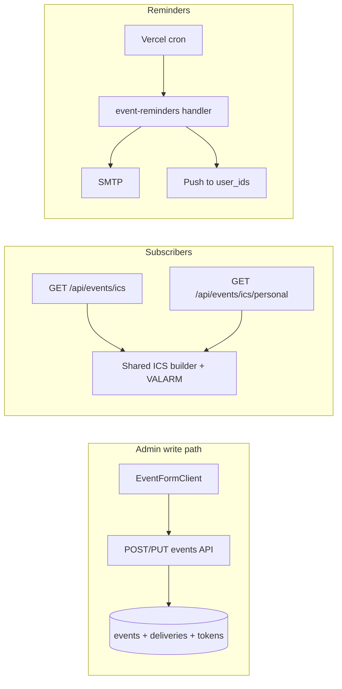
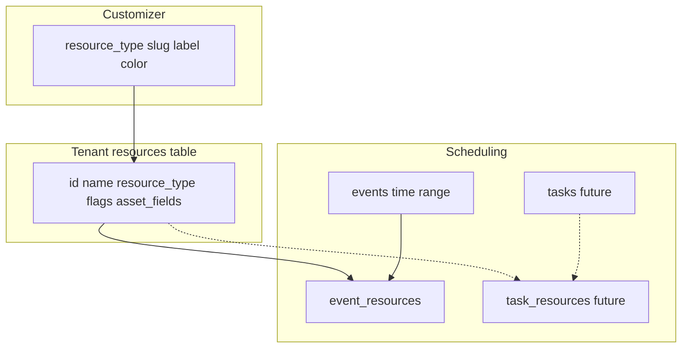

# Session Log

**Purpose:** Active, focused session continuity. Kept lean.

**Workflow:** Session start → read this + changelog "Context for Next Session". Session end → check off in planlog, delete completed from here, add context to changelog.

**Testing after a code session (if the app looks unstyled / "lost CSS"):** (1) Use **http://localhost:3000** for both public and admin (not port 5000). (2) Hard refresh: `Ctrl+Shift+R` or disable cache in DevTools → Network and reload. (3) Restart dev: stop the server, delete the `.next` folder, run `pnpm run dev` again, then open a fresh tab to localhost:3000.

**Performance (speed):** See [prd.md](./prd.md) and [planlog.md](./planlog.md) — Performance (Speed).

---
## Next up

**Next session — Task UI:** **Task detail page** (layout, density, related sections) and **more task UI** polish across admin flows. **Migration 187** is **applied** on the current tenant (SQL Editor); re-run only for **other** schemas/forks.

**Projects & Tasks** — Task **status / type / phase** are **Customizer slugs only** (code in repo); projects still use taxonomy where unchanged. **Phase 21 (resources):** schema step done — migration `183_resources_asset_and_scheduling.sql` applied; API/UI/usage still open (see [Asset / Resource Management (planned)](#asset--resource-management-planned)).

**Implementation order (start here):**

- [x] **Projects & Tasks — customizer (tasks):** Tasks use `customizer` scopes `task_type`, `task_status`, `task_phase` via **`task_*_slug`** columns + migration **187** (no taxonomy for those dimensions on tasks).
- [ ] **Projects & Tasks — customizer (projects):** Continue aligning project pickers/badges with Customizer where still mixed with taxonomy (see Settings → Customizer).
- [ ] **Projects and Tasks UI Enhance** — *Shipped:* admin **projects list** refresh (table: type dot, dates, client + avatars, status/type pills, member avatars, task-segment progress). *Still open:* **task detail** + tasks list polish, project detail progress vs list, presets, etc.
- [ ] **Custom view presets (optional):** user_view_presets table; API; View dropdown on projects/tasks lists.
- [ ] **Add Reconcile with Stripe feature for Products** — Same as for transactions; add to Products page action dropdown.
- [x] **Sidebar — Content consolidation:** One top-level Content with sub-items Text Blocks, Media, Galleries; remove separate Media top-level.
- [x] **Feature registry, sidebar gating & roles (Phase 19):** projects in registry; sidebar gating; roles.
- [ ] **Review feature registry, Roles and Gating to make sure it aligns after recent updates** We re-arranged the Customizer and Taxonomy
- [ ] **Incorporate Baseline Platform under Marketing** Use Baseline for client brand, logo, voice
- [ ] **Calendar — reminders & personal ICS feeds:** Step-by-step plan in section [Calendar: reminders & personal ICS feeds (planned)](#calendar-reminders--personal-ics-feeds-planned) below; mirrored as **Phase 20** in [planlog.md](./planlog.md).
- [ ] **Asset / Resource Management:** Lightweight inventory + scheduling + usage analytics. Full plan in section [Asset / Resource Management (planned)](#asset--resource-management-planned) below; mirrored as **Phase 21** in [planlog.md](./planlog.md).

**Workflow:** Check off here → sync to planlog cleanup items → at session end, changelog + remove completed from here.

---

## Taxonomy updates

**Goal:** One home section per category (drop multi-section for categories); global `display_order` on category rows for scoped drag-and-drop + Save; tags remain multi-section / global. Pickers and scoped lists use hierarchy + sibling order; full list can sort by name/slug or by section order then tree.

- [x] **Schema — category home + order:** Migration `175_taxonomy_category_home_order.sql` adds `home_section_name`, `display_order`; updates `get_taxonomy_terms_dynamic`. Run in Supabase SQL Editor. Slug remains globally unique for now.
- [x] **Data migration — single section per category:** Included in 175: backfill home, `display_order`, rebuild `category_slugs` per section, `suggested_sections` = `[home]`.
- [x] **Category edit modal — single section:** Categories use one “Home taxonomy section” select; tags keep multi-section checkboxes. Save rebuilds all sections’ `category_slugs`.
- [x] **Taxonomy Sections tab:** Section add/edit no longer exposes category pickers — categories are assigned via each category’s home section + drag order; `category_slugs` on section rows is preserved/rebuilt from category saves (not edited manually in the modal).
- [x] **Taxonomy Sections list — column semantics:** Categories column = count of terms with `home_section_name` = row; Tags = `tag_slugs.length` (tooltips on headers).
- [x] **Categories list — drag-and-drop (scoped):** Filter by section → drag handle reorders siblings → **Save order** updates `display_order` + rebuilds slugs.
- [ ] **Consumers — pickers & APIs:** Order category pickers by `display_order` then name (tasks/projects/content) — next pass.

---

## Site Visitor Analytics

*(After Phase 19 expansion; before pre-fork.)* Scope: schema, tracking, API, admin dashboard graph, GPUM page views in activity stream.

- [ ] **Site Visitor Analytics — schema:** Table(s) for visitor events or aggregates (tenant-scoped). Optional: member page views (contact_id, path, visited_at) for GPUM. Migration; RLS.
- [ ] **Site Visitor Analytics — tracking:** Record public page visits (API or middleware); minimal data (path, date). No PII for anonymous. When logged-in GPUM: optionally record with contact_id for activity stream.
- [ ] **Site Visitor Analytics — API:** Endpoints for aggregated stats (date range, path) for admin.
- [ ] **Site Visitor Analytics — dashboard:** Admin dashboard widget/section with visitor statistics and graph.
- [ ] **Site Visitor Analytics — GPUM page views in activity stream:** Record GPUM page views; include in getMemberActivity so "Viewed: …" shows in member activity stream (and admin contact view). Content pages only if desired.
- [ ] **Admin Level Tool** This tracking info shows in the admin activity stream - not the GPMU members stream
---

## Calendar: reminders & personal ICS feeds (planned)

**Goal:** Per-event **reminder offsets** (e.g. 15 / 60 minutes before start), **delivery** via email + PWA push (and optional in-app), a **cron** job that finds due reminders and notifies without double-sending; **personal ICS / webcal** subscription so team users can add “my events” to Apple/Google Calendar, with **VALARM** in ICS when a reminder is configured. **Public** `GET /api/events/ics` already exists (published public events only) — extend with shared ICS building blocks and a **token-gated personal** feed.

**Already shipped (related, not part of this track):** **POST /api/events** auto-assigns the signed-in creator as a `team_member` participant so new events show in **My View** and can be included in a personal feed query. See changelog 2026-03-19.

### Architecture (high level)

### Implementation order (do roughly in this sequence)

- [ ] **1. Schema (tenant schema)** — Migration file `XXX_event_reminders_and_feeds.sql` (increment from latest in `supabase/migrations/`). Suggested objects:
  - **`events.reminder_minutes_before`** — `integer` nullable; `NULL` = no reminder; positive = minutes before `start_date` (document semantics for all-day vs timed in code comments).
  - **`event_reminder_deliveries`** — Tracks send state to avoid duplicates: e.g. `id`, `event_id`, `user_id` (admin recipient), `fire_at` (timestamptz), `sent_at` nullable, `channels` or separate flags (email/push), unique constraint on `(event_id, user_id)` or `(event_id, user_id, fire_at)` depending on design. RLS aligned with existing events/admin patterns.
  - **`calendar_feed_tokens`** — Opaque **hashed** token per user (or per user+tenant): `user_id`, `token_hash`, `created_at`, `last_rotated_at`, optional `filters` JSONB (e.g. included `event_type` slugs). RLS: users can only read/rotate their own; service role or RPC for validate-by-hash on ICS route.
  - Indexes for cron query: events in window by `start_date`, join participants → user_ids; index on `event_reminder_deliveries` for pending sends.
  - **Run in Supabase SQL Editor** (project rule: manual run; include `-- File: XXX_....sql` in header).

- [ ] **2. Types & APIs — reminder field** — Extend `Event` / `EventInsert` / `EventUpdate` in [`src/lib/supabase/events.ts`](src/lib/supabase/events.ts); wire **POST/PUT** [`src/app/api/events/route.ts`](src/app/api/events/route.ts) and [`src/app/api/events/[id]/route.ts`](src/app/api/events/[id]/route.ts). Add control in [`EventFormClient.tsx`](src/app/admin/events/EventFormClient.tsx) (e.g. number input or preset select: none / 15 / 60 / custom).

- [ ] **3. Shared ICS module** — Extract builders from [`src/app/api/events/ics/route.ts`](src/app/api/events/ics/route.ts) into e.g. [`src/lib/calendar/ics.ts`](src/lib/calendar/ics.ts): `icsEscape`, date formatting, `eventToVevent`, calendar wrapper. Add **VALARM** component when `reminder_minutes_before` is set (RFC 5545; test Apple/Google import).

- [ ] **4. Personal ICS route** — `GET /api/events/ics/personal` (or `/api/events/ics/me`): query param `token=` (or `Authorization` bearer — token in URL is standard for webcal). Validate token → resolve `user_id` → load events where that user is a **participant** (reuse participant/event queries; respect visibility/access same as admin calendar where applicable). Optional filter by token’s stored `event_type` list. Return `text/calendar` with `Content-Disposition` / caching headers appropriate for subscriptions.

- [ ] **5. Feed token API + admin UI** — Endpoints: create/rotate token (invalidate old hash), GET current metadata (no raw token after first show — or one-time display). UI: **Settings → Notifications** and/or **Settings → Profile** or **Events** settings: “Personal calendar feed”, show **webcal://** / **https** URL once, copy button, rotate, optional checkboxes for event types to include. Document in [`docs/prd-technical.md`](docs/prd-technical.md) if API surface changes.

- [ ] **6. Notifications — `event_reminder` action** — Add action type to notifications registry (same pattern as `notifyOnFormSubmitted`). Preferences UI: enable email / push for event reminders. Implement `notifyOnEventReminder` (or similar) in send lib: resolve recipient user_ids (participants mapped to team users + optional rules), respect prefs, throttle duplicates using `event_reminder_deliveries`.

- [ ] **7. Push — target by user ids** — If not present: `getPushSubscriptionsForUserIds` (or batch) + helper to send push to specific users (tenant-scoped). Reuse VAPID / existing subscription storage.

- [ ] **8. Cron** — Secured `GET` or `POST` `/api/cron/event-reminders`: verify `CRON_SECRET` (header or query) matches env; query events starting in the next window whose reminder fires “now” (and haven’t been sent); enqueue or send email+push; write `event_reminder_deliveries`. Add **`vercel.json`** `crons` entry; document `CRON_SECRET` in env templates / tenant checklist.

### Edge cases / decisions (capture when implementing)

- **Recurring events:** MVP can scope to **single `events` rows** only; if `recurrence_rule` is used, define whether reminder fires per exception/instance or first occurrence only — document in migration comment + PRD technical.
- **All-day events:** Define reminder time as “start of day” in tenant/event timezone vs UTC; align with `events.timezone`.
- **Participants without push/email:** Skip channel; still mark delivery row if “no-op” or leave unsent — avoid infinite retries.
- **Superadmin without team_member participant:** Personal feed may be empty until they have a participant row; creator-as-participant on create helps for events they create.

**Workflow:** Check items here as you go → sync completed bullets to [planlog.md](./planlog.md) (Phase 20) → session-end changelog.

---

## Asset / Resource Management (planned)

**Goal:** Treat `resources` as a **lightweight asset registry** (serial, purchase date, location, status, optional cost fields) while keeping **Customizer** as the single source of truth for **resource type** (slug, label, **color**). Add **schedulability flags** so only intended assets appear in calendar/task pickers. On **Activities → Resources**, show a **usage analytics** view: date-range presets (7 / 30 / 90 days, 1 year, custom), sortable table of resources by **scheduled usage** derived from linked **events** (and later **tasks**). Optional small charts (top resources by hours, share by type). Purpose: ops insight (“is Meeting Room A overbooked?”) without a separate heavy CMMS.

**Principles**

- **One table (`resources`)** — inventory + bookable entity; avoid duplicating “assets” vs “resources.”
- **Customizer** — `resource_type` rows: slug, label, `color` (like event types). No per-resource color column unless you later need historical snapshot colors.
- **Derived usage first** — `event_resources` + `events.start_date` / `end_date` → hours in range; no `resource_usage_log` until you need manual/ad-hoc usage or audit-grade actuals.
- **Tasks later** — `task_resources` (or equivalent) with planned/actual minutes; project rollup = aggregate from child tasks.

### Architecture (high level)

### Implementation order (recommended)

- [x] **1. Schema — asset + schedulability columns (tenant `resources`)** — **Done:** `183_resources_asset_and_scheduling.sql` (run in Supabase SQL Editor per tenant schema). Columns added:
  - `is_schedulable_calendar` `boolean NOT NULL DEFAULT true`
  - `is_schedulable_tasks` `boolean NOT NULL DEFAULT false` (flip default when task pickers ship)
  - `asset_status` `text NOT NULL DEFAULT 'active'` with check values (e.g. `active | maintenance | retired`)
  - `archived_at` `timestamptz` nullable (retain retired assets for audit history; no hard deletes)
  - `serial_number` `text`, `purchase_date` `date`, `warranty_expires` `date` (optional)
  - `vendor` `text`, `location` `text`, `notes` `text` (optional)
  - Financial (confirmed for v1): `purchase_cost numeric(12,2)`, `replacement_cost numeric(12,2)`, `currency text NOT NULL DEFAULT 'USD'`
  - Constraints (v1): `currency = 'USD'`, `purchase_cost >= 0`, `replacement_cost >= 0`
  - Indexes: schedulability + `archived_at`; existing `(resource_type)` unchanged.

- [ ] **2. Types & API** — Extend `Resource` type and [`participants-resources.ts`](src/lib/supabase/participants-resources.ts) create/update payloads; [`GET/POST /api/events/resources`](src/app/api/events/resources/route.ts), [`PUT/DELETE .../[id]`](src/app/api/events/resources/[id]/route.ts) accept new fields. Enforce admin auth as today.

- [ ] **3. Picker gating — calendar** — [`GET /api/events/resources`](src/app/api/events/resources/route.ts) (and any RPC if used) returns only rows where `is_schedulable_calendar = true` **or** add query param `for_picker=true` defaulting to schedulable-only; keep full list for Activities/Resources admin page. Update [`EventParticipantsResourcesTab`](src/components/events/EventParticipantsResourcesTab.tsx) / event form to use gated list.

- [ ] **4. UI — Resources admin (`ResourcesListClient` + page)** — [`ResourcesListClient.tsx`](src/components/events/ResourcesListClient.tsx), [`admin/events/resources/page.tsx`](src/app/admin/events/resources/page.tsx):
  - Columns: type **color chip** + label (resolve from Customizer by `resource_type` slug), name, schedulability checkboxes, key asset fields (collapsed/detail drawer or second row on mobile).
  - Add/Edit dialog: asset fields + flags; on type change, show **preview color** from Customizer (same pattern as event type picker).

- [ ] **5. Usage analytics API** — New route e.g. `GET /api/events/resources/usage?start=&end=` (admin): join `resources` ← `event_resources` ← `events` where event overlaps range; compute per resource: `assignment_count`, `total_minutes` / `total_hours`, `last_used_at`; optional `by_week` series for charts. Respect cancelled/draft filters consistent with calendar (document which `events.status` rows count).

- [ ] **6. UI — usage strip on Resources page** — Presets: Last 7 / 30 / 90 days, Last year, Custom range; table sortable by total hours; optional Recharts/bar: top N resources; donut by type (using Customizer colors).

- [ ] **7. Tasks module (follow-on)** — Schema `task_resources` (`task_id`, `resource_id`, `planned_minutes`, `actual_minutes` or link to existing time logs); API; task UI picker (gated by `is_schedulable_tasks`); extend usage API to **union** event + task minutes with `source` column; project detail rollup = sum of tasks.

- [ ] **8. Docs** — Update [`docs/mvt.md`](docs/mvt.md) Events/Resources module; [`docs/prd-technical.md`](docs/prd-technical.md) short spec for resources vs customizer vs usage.

### Decisions confirmed (ready for schema)

1. **Financial fields in v1:** Include `purchase_cost` and `replacement_cost` on `resources` for accounting/depreciation reports.
2. **Currency model:** USD-only for this tenant and tenant clients; enforce `currency = 'USD'` in DB for v1.
3. **Retired assets:** Use **both** `asset_status` and `archived_at` to preserve lifecycle state + audit history.
4. **Default schedulability:** New resources default to calendar schedulable only (`is_schedulable_calendar = true`, `is_schedulable_tasks = false`).
5. **Usage definition:** v1 = **scheduled** time from event start/end only; **actual** time waits for task time logs / explicit fields.

**Workflow:** Check items here → sync to [planlog.md](./planlog.md) **Phase 21** → session-end changelog.

---

## Pre-fork: Security review & fork deployment checklist

**Carries over to the new fork.** Two parts:

- [ ] **a. Security review** — Review the app for security concerns (auth, RLS, input validation, per-feature pass). See planlog → Code Review, Security & Modular Alignment; Error handling (404/500, membership denied); Performance as needed for v1.
- [ ] **b. Fork deployment checklist** — Create and document the checklist needed for deploying a fork of the application.
  - Test Automated Client Setup Script (`pnpm setup-client <schema-name>`)
  - Template (root) domain deployment: Vercel, env vars, superadmin user, test auth
  - Integrations: test script injection, enable/disable, superadmin-only access
  - Document and lock down the fork deployment checklist for future client launches (e.g. first fork: **phpbme**, domain **phpbme.com**)

---
## Reference (design locked / Phase 19)

- **Invoicing (locked):** Schema, number generator, shared sequence with orders, flow, customer identifiers — see changelog 2026-03-14 entry and planlog Phase 19 as needed.
- **Phase 19 (Project Management):** Taxonomy for projects/tasks, MAG parent/child (done), CRM Organizations (done). Remaining: Project Management (projects + tasks) step-by-step in planlog.
- **Support project (per GPUM):** Created when GPUM starts a support process (first ticket), not on member creation. **Status** = perpetual (lives with the life of the client). **Category** = Support Ticket (taxonomy). One perpetual Support project per GPUM; all their support_ticket tasks link to it.
- **Conversation = thread:** One unified activity-stream concept: a conversation is a comment thread, support ticket thread, or message thread. Identified by `conversation_uid` (task threads use `task:${taskId}`). Get/set by conversation_uid; same createNote flow.

---
## Paused / Later

- **Member area (GPUM) UI** — Projects, Support Tickets, Tasks in member area: do later (after current step plan). Planlog Phase 19 has the spec.

_(Optional — move items to planlog when they become backlog.)_
